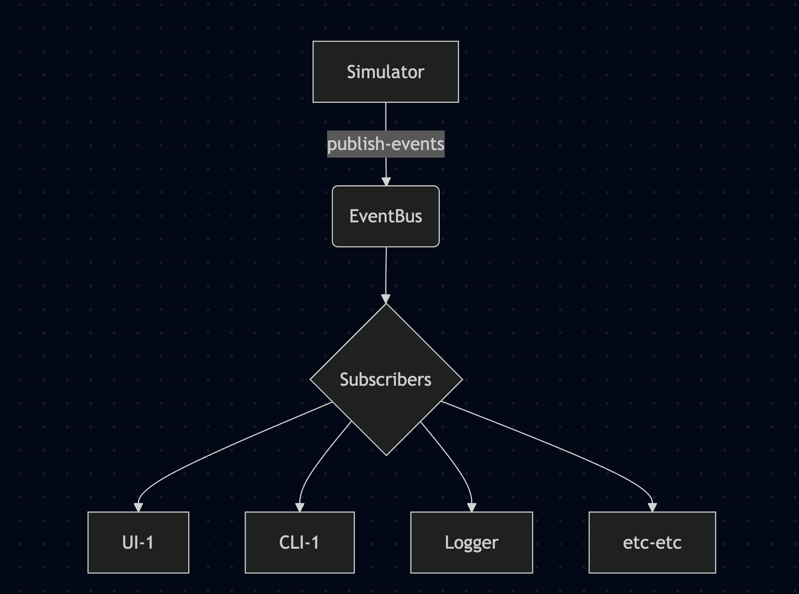
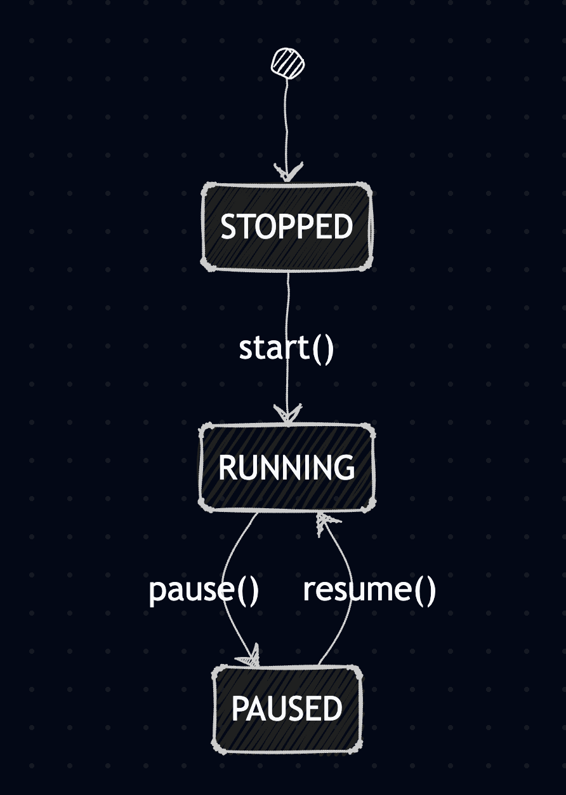

# Architecture Design Decisions

Architecture notes for the particle simulator.

## Core Principle

**The simulation tick must never block on I/O or slow consumers.**

Wanted to keep the simulator as simple as possible and not have to worry about I/O or slow consumers. One of the reason why Redis / Kafka is not used in this POC since for us message durability and horizontal scaling is not a requierment at this moment, if needed the system can be extended to support these features.

---

## Event Bus

Copy-on-write subscriber list with per-subscriber bounded queues.
The EventBus is the pub/sub backbone of the system. 
It decouples the simulation engine from consumers (UI, logger, etc.).



How it works:

**Subscribe (cold path):** 
    When a new client connects, the bus acquires a lock, adds the subscriber to the dictionary, and creates a fresh snapshot (a simple Python list copy). 
    This is not a very aggressive event to occur so it's not a performance concern.

**Publish (hot path):** 
    When the simulation publishes an event, it iterates over the pre-built snapshot without any locking. Since the snapshot is immutable once created, multiple publishes can happen concurrently without coordination.

**Backpressure handling:** 
    Each subscriber has a bounded queue. If a subscriber's queue is full (slow consumer), the event is dropped for that subscriber only - other subscribers still receive it. The simulation never waits.

Trade-off:

    Events can be lost under backpressure, but the simulation keeps running at full speed. For real-time systems, maintaining consistent tick rate matters more than guaranteed delivery to every consumer.

---

### Extensibility

The EventBus designed as minimal interface with the following methods (`subscribe`, `publish`, `unsubscribe`), making it easy to swap implementations with different backends:

| Backend | Use Case |
|---------|----------|
| In-memory (current) | Single process, low latency |
| Redis pub/sub | Multi-process, horizontal scaling |
| Kafka | High throughput, durability, replay |

To swap backends, we can implement the same interface and inject via config:

```python
if config.bus.type == "kafka":
    bus = KafkaEventBus(config.bus.url)
elif config.bus.type == "redis":
    bus = RedisEventBus(config.bus.url)
else:
    bus = EventBus(queue_size=100)
```

---

## Engine States

Three explicit states instead of a boolean `paused` flag:




| State | Tick Advances | Publishes |
|-------|---------------|-----------|
| STOPPED | No | No |
| RUNNING | Yes | Yes |
| PAUSED | No | No |

prevents event flooding when the engine is paused: only publish the events when tick actually changes.

---

## Error Handling

Errors are isolated so that one bad particle doesn't crash the simulation loop:

```python
for particle in self.particles:
    try:
        particle.step(dt, world)
    except Exception:
        # log and continue
```

Every error gets a KSUID for tracing so using erroroneus KSUID events we can sort the events and find the root cause.

---

## Routes

Split into modules under `ui/routes/`:

| Module | Routes | Auth |
|--------|--------|------|
| control.py | `/api/v1/control/*` | Basic |
| api.py | `/api/v1/stats`, `/api/v1/subscribers` | Basic |
| health.py | `/api/v1/health`, `/api/v1/heartbeat` | None |


Control - pause, resume, reset
Stats - returns the stats of the simulation like tick rate, number of particles, etc.
Subscribers - returns the list of subscribers with their queue sizes
Health - health, heartbeat (explained in the health section below)

---

## Health Checks

Two endpoints:

| Endpoint | Purpose |
|----------|---------|
| `/health` | Component status (detailed) |
| `/heartbeat` | Quick tick/uptime check |

Heartbeat includes `engine_state` so clients know if paused vs stopped vs stuck. this should be used to detect if the simulation is stuck hence should be very light-weight but health endpoint returns the status of all components by doing all the checks like event bus, simulator, logger, etc.

---

## Logging Module

All Logging in one place: `internal/logging.py`

- `StructuredLogger` - JSON to stderr
- `AsyncFileLogger` - non-blocking file writes

All methods wrapped in try/except so that logging failures never crash the simulation.

---

## Dashboard

Single page, no tabs. Everything visible at once:
- Canvas with particles
- EventBus metrics
- Connected clients
- Streaming logs

SSE reconnects with exponential retry backoff mechanism. the heartbeat endpoint is used to detect if the simulation is stuck or not and accordingly the UI can show the appropriate message. 

---

## Memory vs Disk

State lives in memory only. Events logged to disk  in async manner.

| Approach | Latency |
|----------|---------|
| Memory | ~1microsecond |
| Async disk | ~1microsecond + queue |
| Sync disk | ~1-10ms |

For real-time systems we should have very low-latency systems. We can add checkpoints based implementation later if crash recovery needed in real-time from the simulation perspective.

---

## KSUID

Every state snapshot gets a KSUID (K-Sortable Unique ID) instead of UUID.

Why:
- Time-sortable by string comparison (logs sort naturally)
- No coordination needed (works distributed)
---

## Timestamps

ISO 8601 with microseconds: `2024-12-30T10:15:30.123456Z`

Real-time debugging needs sub-millisecond precision to order events correctly hence microseconds level logging.

---

## Summary

| Decision | Why | Trade-off |
|----------|-----|-----------|
| KSUID | K-Sortable Unique IDs sort chronologically by string comparison, making log analysis easier. No central ID generator needed. | 27 characters vs 4 bytes for an integer increases storage size. |
| Microsecond timestamps | ISO 8601 format with microsecond precision. Essential for debugging real-time systems where events happen milliseconds apart. | Parsing strings is slower than comparing raw integers. |
| Copy-on-write bus | Subscriber list is copied only on subscribe/unsubscribe (rare). Publishing iterates the snapshot without locks. Publish is lock-free. | Extra memory allocation on subscribe. |
| State machine | Engine has explicit states (STOPPED, RUNNING, PAUSED) instead of boolean flags. Makes behavior unambiguous. | More code to handle state transitions. |
| Async logging | Log writes go to a queue, background task flushes to disk. Simulation never waits for I/O. | If app crashes, recent logs in queue may be lost. |
| Error isolation | Each particle's `step()` is wrapped in try/except. One bad particle doesn't crash the simulation. | Errors might go unnoticed if only logged, not raised. |
| Memory-only state | No database, no disk persistence. Fastest possible access. | If process dies, all state is lost. We can add checkpointing later if needed. |
